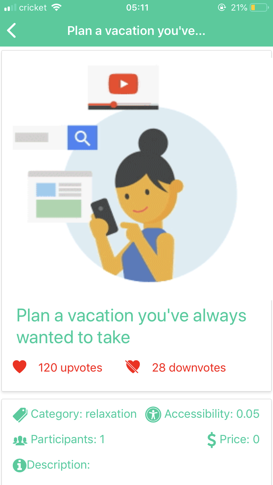
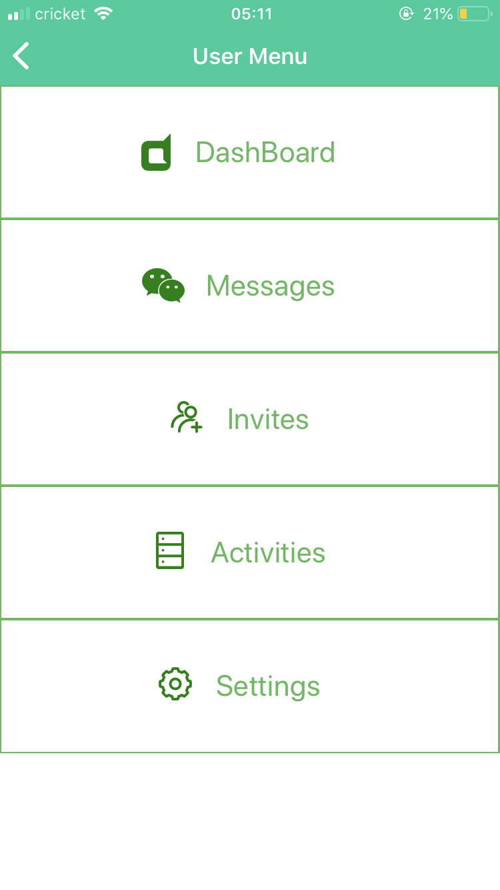
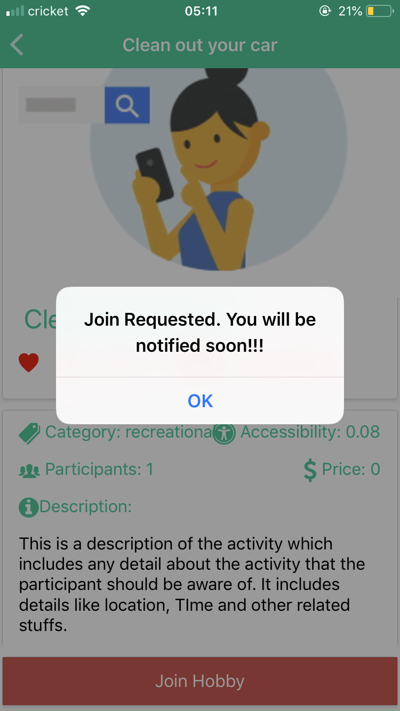
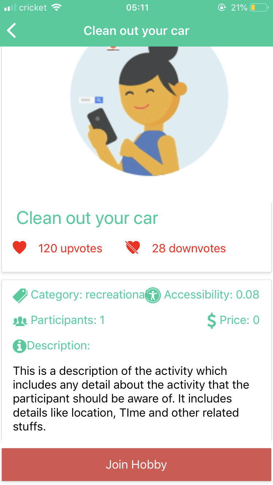
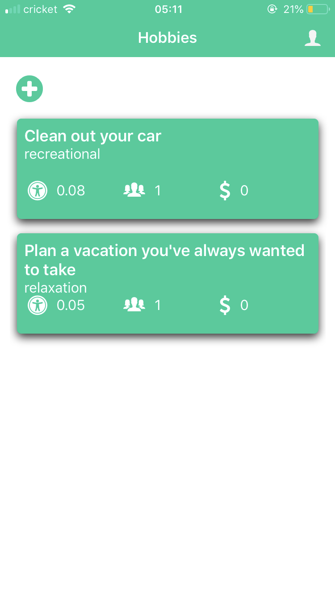

# CodeBuffalo (Team 7)

### Idea : 
To let people decide what they would like to do based on their interests.
Ex: User can create a hobby it could be any activity from reading a book to a group event.
While others can either join them if its a group event or just get a suggestion from others. 
Its more like a social media where anyone could invite any other bored people and hangout.

### Features:

1. Creating a Hobby
2. Upvoting or downvoting others hobby
3. sharing a Hobby
4. Request to join an activity,
5. View other users profile
6. Get a score based on the activities done.(More like a leaderboard).
7. Message other users.
8. Comments

### Business Aspect:
1. Advertising... yes obviously... based on the user's interests.
2. Local company could list or post an event. Ex: organise a party or dinner or skating event or Food       festival...

### How we used BoredApi:
1. Our idea is to combine boredapi as well as events created by users (maintained in our db) USING GRAPHQL.
2. Using Graphql client to retrieve the data we want.

Hence the requirements are satisfied....:)

Considering the time... we could able to setup and retrieve the data using Graphql and create a react application in both ios and android which successfully gets the data from the server.

Please use snack.expo to view the application.

## Screenshots :

     
